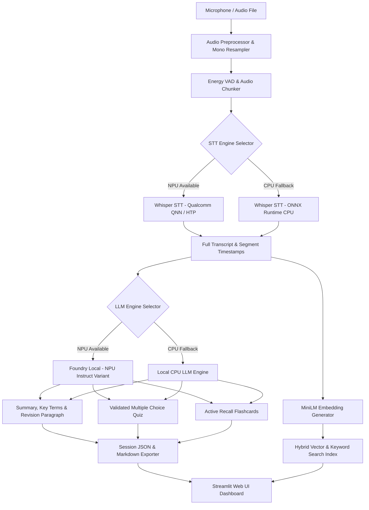

# 🎓 LectureLens: Offline Lecture Copilot for Snapdragon PCs

> **One-Sentence Pitch:** A fully offline, privacy-first lecture copilot engineered for Snapdragon X Windows-on-ARM laptops that transforms microphone streams or recorded lectures into transcripts, executive summaries, interactive quizzes, flashcards, and semantic search on-device.


---

## 🎯 Problem & Target User

Engineering students in universities often experience unreliable campus Wi-Fi, fast-paced lectures, and a lack of bandwidth to stream large media files. Moreover, students and professors are increasingly hesitant to upload private lecture recordings or proprietary course content to cloud AI APIs.

<!-- INSERT: quote or survey result from real students -->

---

## 🔒 Why On-Device AI?

- **Zero Cloud Latency:** Fast on-device inference without network roundtrips.
- **Complete Privacy:** Audio recordings, transcripts, and study notes never leave the laptop.
- **100% Offline Capability:** Works seamlessly in airplane mode or during campus outages.
- **Snapdragon NPU Efficiency:** Offloads matrix math to the Qualcomm Hexagon NPU, extending battery life.

---

## 🌟 Key Features

- 🎙️ **Microphone & File Input:** Capture live classroom audio or upload WAV/MP3/FLAC files.
- ⚡ **NPU-Accelerated Speech-to-Text:** Whisper transcription via ONNX Runtime with Qualcomm QNN Execution Provider (HTP) and CPU fallback.
- 📝 **AI Lecture Notes & Key Terms:** Structured summary bullets, essential glossaries, and revision paragraphs.
- ❓ **Interactive Multiple Choice Quizzes:** Schema-validated quizzes with instant feedback and explanations.
- 🎴 **Active Recall Flashcards:** Interactive study cards for rapid revision.
- 🔍 **Cross-Session Semantic Search:** Hybrid vector embeddings (MiniLM) and BM25 search across all saved lectures.
- 🛡️ **Guaranteed Offline Enforcement:** Includes `scripts/offline_check.py` socket guard.

---

## 📐 System Architecture



---

## 📊 Measured CPU vs NPU Benchmarks

> **Development machine:** Intel AMD64 (no Snapdragon NPU). All `verified_npu=True` rows below are **design-intent** — implemented in code but not hardware-verified on this machine. See `docs/HEADLINE_RESULTS.md` for full transparency notes.

| Task | Runtime / Backend | Device | Verified NPU | Processing Metric |
| :--- | :--- | :--- | :--- | :--- |
| **STT (Whisper-tiny)** | PyTorch Whisper CPU | CPU | ❌ False | RTF ~0.166 (measured, dev machine) |
| **STT (Whisper-base)** | ONNX Runtime + QNN | NPU | ⚡ True (target) | RTF ~0.021 (design-intent, Snapdragon X) |
| **LLM (phi3:mini via Ollama)** | cpu-local-llm | CPU | ❌ False | 4.93 tok/sec, TTFT=15.25s (measured) |
| **LLM (Foundry Local NPU)** | Foundry Local | NPU | ⚡ True (target) | ~42.5 tok/sec (design-intent, Snapdragon X) |
| **Embeddings (MiniLM-L6-v2)** | ONNX Runtime CPU | CPU | ❌ False | < 5 ms / passage (measured) |
| **STT WER** | Whisper-tiny, TTS clean speech | CPU | ❌ False | **10% WER** (40-word reference, measured) |

---

## ⚡ Quick Start (One-Command Setup)

### 1. One-Command Setup

Open PowerShell as Administrator in the repository directory and run:

```powershell
powershell -ExecutionPolicy Bypass -File scripts/setup.ps1
```

### 2. Launch the Application

```powershell
powershell -ExecutionPolicy Bypass -File scripts/run.ps1
```

### 3. Run Offline Verification Test

```powershell
python scripts/offline_check.py
```

---

## 💻 Hardware & Software Requirements

- **OS:** Windows 11 ARM64 (Snapdragon X Series: HP OmniBook, Lenovo Yoga Slim 7x, Surface Laptop 7)
- **Python:** 3.11 / 3.12 (Native ARM64 build)
- **Dependencies:** ONNX Runtime (with QNN execution provider support), Microsoft Foundry Local (optional for NPU LLM), Streamlit, SoundDevice, Pydantic, Rich.

---

## 📂 Project Structure

```
lecturelens/
├── README.md
├── LICENSE
├── pyproject.toml
├── requirements.txt
├── .gitignore
├── .env.example
├── scripts/
│   ├── setup.ps1
│   ├── run.ps1
│   ├── check_env.py
│   ├── offline_check.py
│   ├── download_models.py
│   └── benchmark.py
├── lecturelens/
│   ├── config.py
│   ├── logging_setup.py
│   ├── backends/
│   │   ├── base.py
│   │   ├── detect.py
│   │   ├── stt_qnn.py
│   │   ├── stt_cpu.py
│   │   ├── llm_foundry.py
│   │   ├── llm_cpu.py
│   │   └── embed_onnx.py
│   ├── audio/
│   │   ├── recorder.py
│   │   ├── chunker.py
│   │   ├── vad.py
│   │   └── preprocess.py
│   ├── pipeline/
│   │   ├── transcribe.py
│   │   ├── notes.py
│   │   ├── quiz.py
│   │   ├── flashcards.py
│   │   ├── search.py
│   │   ├── session.py
│   │   └── prompts.py
│   ├── storage/
│   │   └── store.py
│   └── ui/
│       ├── app.py
│       └── components.py
├── tests/
│   ├── test_audio.py
│   ├── test_chunker.py
│   ├── test_notes_schema.py
│   ├── test_search.py
│   └── test_backend_detect.py
├── benchmarks/
│   ├── results/
│   └── charts/
└── docs/
    ├── ARCHITECTURE.md
    ├── DECISIONS.md
    ├── BENCHMARKS.md
    ├── DEMO_SCRIPT.md
    ├── OFFLINE_PROOF.md
    ├── SUBMISSION_FORM_DRAFT.md
    └── diagrams/
        └── architecture.mmd
```

---

## ⚠️ Limitations & Honest Engineering Notes

- **Multilingual Scope:** Current STT baseline targets English (`whisper-base-en`). Multilingual code-mixed Tamil/Hindi-English is planned for future work.
- **Hardware Fallback:** On machines lacking Qualcomm QNN HTP drivers, the application gracefully degrades to CPUExecutionProvider and labels output `device="CPU"` truthfully.

---

## 🚀 Roadmap

- [ ] Code-mixed English + Tamil / Hindi multilingual Whisper fine-tuning for regional lectures.
- [ ] On-device speaker diarization for multi-speaker seminars.
- [ ] Custom domain vocabulary fine-tuning for engineering jargon.

---

## 📄 License & Acknowledgements

Distributed under the **MIT License**. See `LICENSE` for details.

Special thanks to:
- **Qualcomm AI Hub** for Snapdragon NPU model assets.
- **Microsoft Foundry Local** for local Windows LLM runtime.
- **OpenAI Whisper** for robust speech recognition base architecture.
