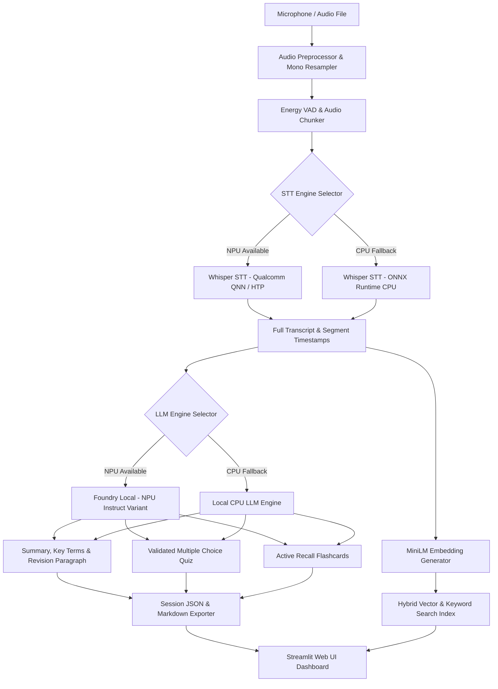

# LectureLens Architecture Documentation

## Overview

LectureLens is an offline lecture copilot engineered specifically for Snapdragon X Windows-on-ARM laptops. The architecture prioritizes privacy, low latency, and hardware acceleration on Qualcomm Hexagon NPUs with strict CPU fallback guarantees.

## System Architecture Diagram

## Key Architectural Principles

1. **Hardware Acceleration First:** Leverages `QNNExecutionProvider` (HTP backend) for speech recognition and Microsoft Foundry Local for NPU-accelerated LLM inferencing.
2. **Zero Cloud Dependency:** Operates 100% offline with socket guard validation (`scripts/offline_check.py`).
3. **Resilient Abstraction:** All AI runtimes sit behind abstract interfaces (`STTBackend`, `LLMBackend`, `EmbedBackend`).
4. **Energy VAD Filtering:** Uses RMS frame energy detection to skip silent intervals and conserve battery.
